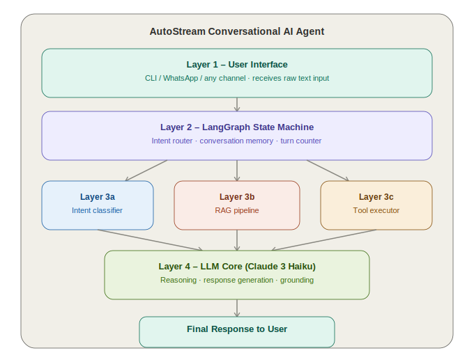
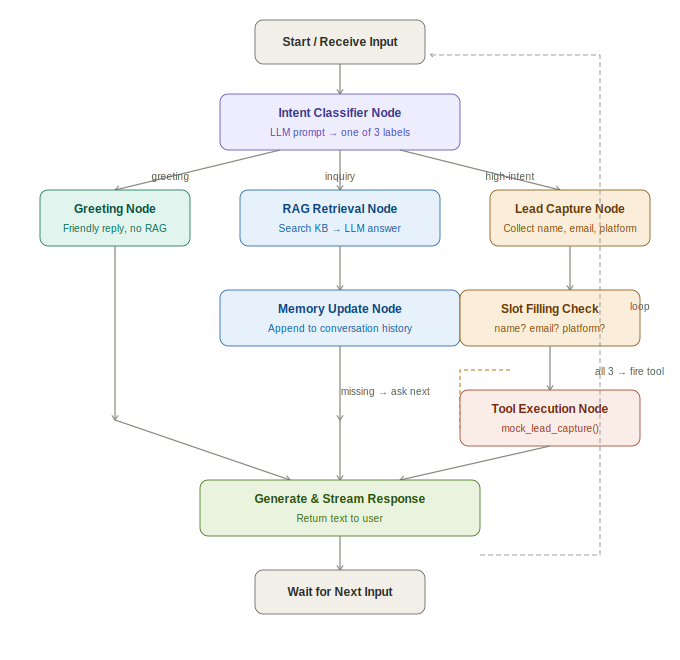
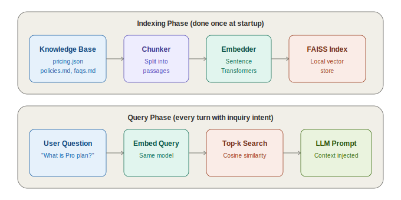
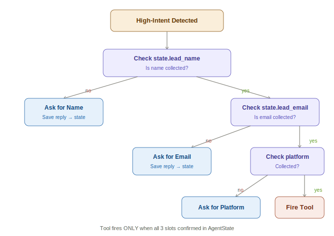

# AutoStream AI Agent — Social-to-Lead Agentic Workflow


---

## Table of Contents
1. [Project Overview](#project-overview)
2. [Architecture](#architecture)
3. [Tech Stack](#tech-stack)
4. [Project Structure](#project-structure)
5. [How to Run Locally](#how-to-run-locally)
6. [Agent Capabilities](#agent-capabilities)
7. [State Management](#state-management)
8. [WhatsApp Deployment](#whatsapp-deployment)
9. [Example Conversation](#example-conversation)

---

## Project Overview

AutoStream Agent is a production-grade conversational AI agent that converts social media conversations into qualified business leads. It is built for **AutoStream** — a fictional SaaS company providing AI-powered video editing tools for content creators.

The agent can:
- **Classify user intent** (greeting / product inquiry / high-intent lead)
- **Answer product questions accurately** using a local RAG knowledge base
- **Detect high-intent users** and smoothly transition to lead collection
- **Collect lead details** (name, email, platform) through natural conversation
- **Trigger lead capture** only after all three fields are confirmed

---

## Architecture

### Layer 1 — System Overview

The agent is built as a 5-layer system. The user communicates through the outermost layer and the system routes intelligently through inner layers based on intent.



---

### Layer 2 — LangGraph State Machine (The Brain)

The core of the agent is a **LangGraph directed state graph**. Every user message passes through the intent classifier, which routes to one of three handler nodes. The conversation state is fully preserved across all turns using a typed `AgentState` object.



**Graph nodes:**
| Node | Responsibility |
|---|---|
| `classify_intent` | Classifies user message into greeting / inquiry / high_intent / lead_collection |
| `handle_greeting` | Generates a warm welcome, no RAG |
| `handle_inquiry` | Retrieves KB context via RAG, generates grounded answer |
| `start_lead_capture` | Acknowledges intent, starts slot collection |
| `collect_lead_slot` | Fills name → email → platform slots, fires tool when all 3 are ready |
| `handle_unknown` | Redirects off-topic messages gracefully |

---

### Layer 3b — RAG Pipeline

Instead of the LLM hallucinating answers, every product/pricing question is grounded in a **local FAISS vector store** built from the knowledge base files.



**How it works:**
1. At startup, `pricing.json`, `policies.md`, and `faqs.md` are chunked into passages
2. Each passage is embedded using `sentence-transformers/all-MiniLM-L6-v2` (fully local)
3. Embeddings are stored in a **FAISS IndexFlatIP** (cosine similarity)
4. On every inquiry, the user's question is embedded and top-3 passages are retrieved
5. Retrieved context is injected into the LLM prompt as grounding

---

### Layer 3c — Lead Capture Guard

The lead capture tool (`mock_lead_capture`) is **guarded by a slot-filling state machine**. It is physically impossible for the tool to fire before all three fields are collected.



The `AgentState` tracks which slot is currently being collected via `awaiting_slot`. When all three slots are set in state and the `lead_captured` flag is `False`, only then does the tool execute.

---

## Tech Stack

| Component | Technology | Why |
|---|---|---|
| **Agent Framework** | LangGraph 0.4+ | Native typed state graph, perfect for multi-turn slot filling and conditional routing |
| **LLM** | Groq `llama-3.3-70b-versatile` (primary) / Claude 3 Haiku (fallback) | Groq's LPU hardware is the fastest inference available; auto-selects based on API key in `.env` |
| **Embeddings** | sentence-transformers `all-MiniLM-L6-v2` | 100% local, no API cost, 384-dim dense embeddings |
| **Vector Store** | FAISS (IndexFlatIP) | In-memory, production-grade, cosine similarity retrieval |
| **Knowledge Base** | JSON + Markdown | Human-readable, easily extensible |
| **Memory** | LangGraph `StateGraph` + `AgentState` | Typed state persists natively across all turns |
| **Environment** | python-dotenv | Secure API key management |

---

## Project Structure

```
autostream_flat/
├── main.py                        # CLI entry point
├── requirements.txt               # All dependencies
├── .env.example                   # Environment variable template
├── .gitignore
├── agent_graph.py                 # LangGraph nodes + graph builder
├── agent_rag_pipeline.py          # FAISS-based RAG implementation
├── agent_state.py                 # AgentState TypedDict schema
├── tools_lead_capture.py          # mock_lead_capture() tool
├── knowledge_base_pricing.json    # AutoStream plans & features
├── knowledge_base_policies.md     # Refund, support, cancellation policies
├── knowledge_base_faqs.md         # Frequently asked questions
├── assets_arch_overview.svg       # Architecture diagram
├── assets_arch_state_flow.svg     # State flow diagram
├── assets_arch_rag_pipeline.svg   # RAG pipeline diagram
└── assets_arch_lead_guard.svg     # Lead capture guard diagram
```

---

## How to Run Locally

### Prerequisites
- Python 3.9 or higher
- An Anthropic API key ([get one here](https://console.anthropic.com/))

### Step 1 — Clone and set up environment

```bash
git clone https://github.com/yourusername/autostream-agent.git
cd autostream-agent

# Create and activate a virtual environment (recommended)
python -m venv venv
source venv/bin/activate        # macOS/Linux
venv\Scripts\activate           # Windows
```

### Step 2 — Install dependencies

```bash
pip install -r requirements.txt
```

> **Note:** `sentence-transformers` will download the embedding model (~80MB) on first run. This is cached and only happens once.

### Step 3 — Configure environment

```bash
cp .env.example .env
```

Open `.env` and add **one** of the following API keys:

**Option A — Groq (recommended, free & ultra-fast ⚡)**
```
GROQ_API_KEY=gsk_...
```
Get a free key at [console.groq.com](https://console.groq.com/) — no credit card needed.
Model used: `llama-3.3-70b-versatile`

**Option B — Anthropic (fallback)**
```
ANTHROPIC_API_KEY=sk-ant-...
```
Model used: `claude-haiku-4-5`

> The agent **auto-detects** which key is set. If `GROQ_API_KEY` is present, Groq is used. Otherwise it falls back to Anthropic.

### Step 4 — Run the agent

```bash
python main.py
```

You should see:

```
[INFO] Initializing RAG pipeline and loading knowledge base...
[RAG] Embedding 24 chunks...
[RAG] Index built — 24 vectors, dim=384
[INFO] Agent ready.

============================================================
   AutoStream AI Agent — Social-to-Lead Workflow
   Powered by LangGraph + Claude 3 Haiku + RAG
============================================================

AutoStream Agent: Hi there! I'm Alex from AutoStream...

You: _
```

### Special commands during conversation

| Command | Action |
|---|---|
| `status` | Print current AgentState (intent, slots, turn count) |
| `quit` / `exit` | End the conversation |

---

## Agent Capabilities

### Intent Classification

Every user message is classified before routing:

| Intent | Trigger Examples |
|---|---|
| `greeting` | "Hi", "Hello", "Hey there" |
| `inquiry` | "What does Pro include?", "How much does it cost?", "What's the refund policy?" |
| `high_intent` | "I want to sign up", "Let's try the Pro plan", "I'm ready to subscribe" |
| `lead_collection` | (internal — active while collecting name/email/platform) |

### RAG Knowledge Base

The agent answers questions from three sources:

- `pricing.json` — Plan names, prices, features, comparisons
- `policies.md` — Refund policy (7 days), support tiers, cancellation
- `faqs.md` — General questions, technical specs, billing

### Lead Capture Flow

```
High-intent detected
       ↓
Ask: "What's your full name?"
       ↓
Ask: "Great! What's your email address?"
       ↓
Ask: "Which platform do you mainly create for?"
       ↓
mock_lead_capture(name, email, platform) ← fires here ONLY
       ↓
Confirmation with Lead ID
```

---

## State Management

The `AgentState` TypedDict is the single source of truth for the entire conversation:

```python
class AgentState(TypedDict):
    messages: List[BaseMessage]      # Full conversation history
    intent: str                      # Latest classified intent
    lead_name: Optional[str]         # Slot 1: collected name
    lead_email: Optional[str]        # Slot 2: collected email
    lead_platform: Optional[str]     # Slot 3: collected platform
    lead_captured: bool              # Guard: prevents double tool-firing
    turn_count: int                  # Number of completed turns
    last_rag_context: Optional[str]  # Last RAG context (for debug)
    awaiting_slot: Optional[str]     # Current slot being collected
```

LangGraph passes this state between every node. Each node receives the full state, makes its modifications, and returns the updated state. The graph loop handles persistence across turns — there is no external memory store needed.

**Memory depth:** The last 6 messages are passed to the LLM on every turn, giving it a 3-turn window of context while keeping token usage efficient.

### Why LangGraph over AutoGen

LangGraph was chosen over AutoGen for three reasons:

1. **Explicit state schema** — `AgentState` gives us typed, inspectable state that makes the slot-filling guard provably correct. With AutoGen's agent-to-agent messaging, state lives implicitly in message history.
2. **Deterministic routing** — LangGraph's conditional edges (`add_conditional_edges`) give us exact control over which node handles which intent. AutoGen's tool-calling is more nondeterministic.
3. **Production deployability** — LangGraph state can be serialized and persisted to Redis/Postgres with one line (`checkpointer=...`), enabling WhatsApp multi-user sessions trivially.

---

## WhatsApp Deployment

### Architecture for WhatsApp Integration

```
WhatsApp User
     ↓ (sends message)
WhatsApp Cloud API
     ↓ (POST webhook)
Your FastAPI Server (e.g., Railway / Render)
     ↓
Session Manager (Redis) ← loads AgentState by phone number
     ↓
LangGraph Agent (same code, no changes)
     ↓
Session Manager ← saves updated AgentState
     ↓
WhatsApp Cloud API (send reply)
     ↓ (delivers message)
WhatsApp User
```

### Implementation Steps

**Step 1 — Set up a FastAPI webhook server:**

```python
from fastapi import FastAPI, Request
from agent.graph import build_graph, create_initial_state

app = FastAPI()
agent = build_graph()

# In-memory sessions (replace with Redis for production)
sessions = {}

@app.post("/webhook")
async def webhook(request: Request):
    body = await request.json()
    
    # Extract message from WhatsApp payload
    message = body["entry"][0]["changes"][0]["value"]["messages"][0]
    phone = message["from"]
    text = message["text"]["body"]
    
    # Load or create session state (keyed by phone number)
    if phone not in sessions:
        sessions[phone] = create_initial_state()
    
    state = sessions[phone]
    state["messages"].append(HumanMessage(content=text))
    
    # Run the agent
    state = agent.invoke(state)
    sessions[phone] = state
    
    # Extract latest response
    reply = state["messages"][-1].content
    
    # Send via WhatsApp Cloud API
    send_whatsapp_message(phone, reply)
    return {"status": "ok"}
```

**Step 2 — Register your webhook in Meta Developer Console:**
- Go to [developers.facebook.com](https://developers.facebook.com)
- Create a WhatsApp Business App
- Set your webhook URL: `https://yourserver.com/webhook`
- Subscribe to `messages` events
- Verify with your webhook token

**Step 3 — For production multi-user memory, replace `sessions = {}` with:**
```python
import redis, json
r = redis.Redis(host="localhost", port=6379)

def load_state(phone): 
    raw = r.get(f"session:{phone}")
    return json.loads(raw) if raw else create_initial_state()

def save_state(phone, state):
    r.set(f"session:{phone}", json.dumps(state), ex=3600)  # 1hr TTL
```

This gives each WhatsApp user their own isolated AgentState with 1-hour session persistence.

---

## Example Conversation

```
You: Hi there!
AutoStream Agent: Hey! I'm Alex from AutoStream 👋 I can help you learn
about our AI video editing plans. What would you like to know?

You: What does the Pro plan include?
AutoStream Agent: The Pro plan is $79/month and includes unlimited videos,
4K resolution output, AI-powered captions, priority rendering, custom
branding, and 24/7 dedicated support. It also includes API access and
team collaboration for up to 5 seats.

You: That sounds great. I want to try the Pro plan for my YouTube channel.
AutoStream Agent: Awesome! YouTube creators love our Pro plan — the AI
captions alone save hours of work. To get you set up, could I get your
full name?

You: John Doe
AutoStream Agent: Nice to meet you, John! What's your email address?

You: john@example.com
AutoStream Agent: Got it! Last question — which platform do you primarily
create for? (YouTube, Instagram, TikTok, etc.)

You: YouTube
==================================================
  LEAD CAPTURED SUCCESSFULLY
==================================================
  Lead ID  : LEAD-20250101120000-JOH
  Name     : John Doe
  Email    : john@example.com
  Platform : YouTube
==================================================

AutoStream Agent: You're all set, John! 🎉 Your lead ID is
LEAD-20250101120000-JOH. Our team will reach out to john@example.com
within 24 hours to get your Pro plan activated. Happy creating!
```

---

## Evaluation Checklist

| Criterion | Implementation |
|---|---|
| Agent reasoning & intent detection | LLM-based 4-class classifier with fallback |
| Correct use of RAG | FAISS + sentence-transformers, context injected into every inquiry |
| Clean state management | Typed `AgentState` TypedDict, persisted by LangGraph across all turns |
| Proper tool calling logic | `awaiting_slot` + `lead_captured` guard — tool cannot fire prematurely |
| Code clarity & structure | Modular packages: agent/, tools/, knowledge_base/ |
| Real-world deployability | WhatsApp webhook architecture documented, Redis session management shown |
